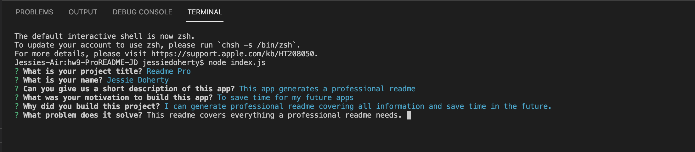
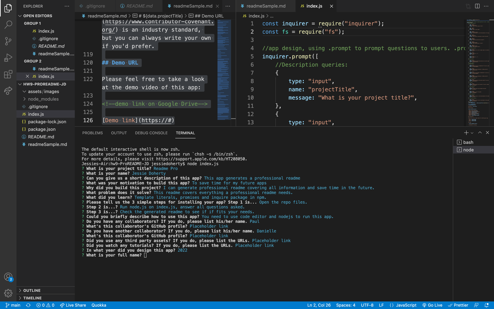
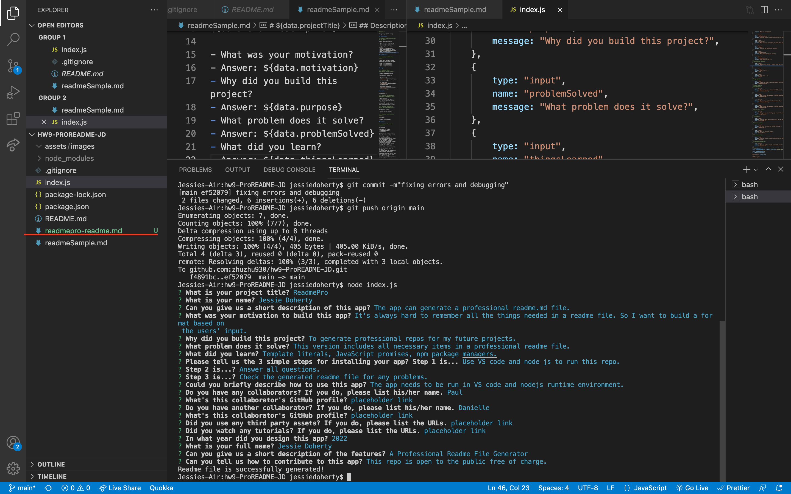

# ReadmePro

Designed by: Jessie Doherty

## Description

This app is designed to generate professional readme file for future repositories.

- What was your motivation?
- Answer: It's hard to remember what to include in a readme file. So I want to make a sample and take users's input to generate a readme file.
- Why did you build this project?
- Answer: This will save a lot of time in the future.
- What problem does it solve?
- Answer: Generate a professional readme file without missing any important points.
- What did you learn?
- Answer: Template literals, JavaScript promises, nodejs runtime environment.

## Installation

Please tell us the 3 simple steps for installing your app.

- Step 1: Fork this repo in my GitHub page, run it with code editor and nodejs
- Step 2: Answer all questions prompted.
- Step 3: Check the generated file to see if everything is there.

## Usage

- Run this app in VS code or any code editor with nodejs runtime environment.
- Screenshots of the App

Terminal side:

VS code side:

Generated Readme.md:

## Credits

Collaborators:

- Name: No.; GitHub Repo: N/A.
- Name: No.; GitHub Repo: N/A.
- Third-party assets: No. I only used the instruction materials.
- Tutorials: No.

## License

    MIT License

    Copyright (c) 2022 Jessie Doherty

    Permission is hereby granted, free of charge, to any person obtaining a copy
    of this software and associated documentation files (the "Software"), to deal
    in the Software without restriction, including without limitation the rights
    to use, copy, modify, merge, publish, distribute, sublicense, and/or sell
    copies of the Software, and to permit persons to whom the Software is
    furnished to do so, subject to the following conditions:

    The above copyright notice and this permission notice shall be included in all
    copies or substantial portions of the Software.

    THE SOFTWARE IS PROVIDED "AS IS", WITHOUT WARRANTY OF ANY KIND, EXPRESS OR
    IMPLIED, INCLUDING BUT NOT LIMITED TO THE WARRANTIES OF MERCHANTABILITY,
    FITNESS FOR A PARTICULAR PURPOSE AND NONINFRINGEMENT. IN NO EVENT SHALL THE
    AUTHORS OR COPYRIGHT HOLDERS BE LIABLE FOR ANY CLAIM, DAMAGES OR OTHER
    LIABILITY, WHETHER IN AN ACTION OF CONTRACT, TORT OR OTHERWISE, ARISING FROM,
    OUT OF OR IN CONNECTION WITH THE SOFTWARE OR THE USE OR OTHER DEALINGS IN THE
    SOFTWARE.

    ---

## 🏆 Miscellaneous

## Badges

## Features

- This app includes all necessary points in a professional readme file.

## How to Contribute

- This repo on my Github page is open to the public free of charge.

## Demo URL

Please feel free to take a look at the demo video of this app:

[Demo link](https://drive.google.com/file/d/1PMw6HrfYfTd0uDhtfg4vlzsGgRSwDm-5/view)
